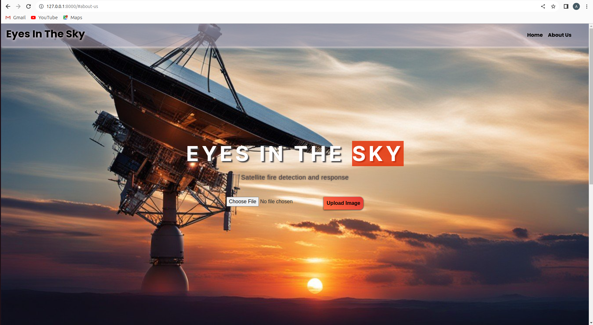
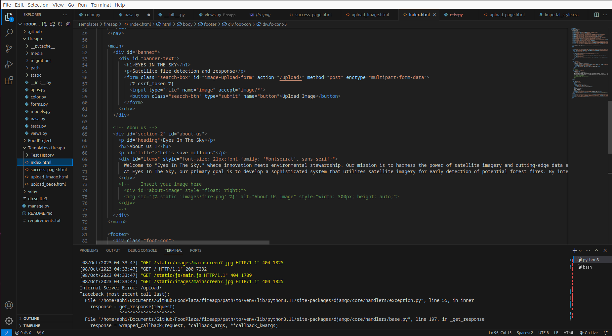

# Eyes In The Sky - Predicting and Preventing Forest Fires
Welcome to "Eyes In The Sky," where innovation meets environmental stewardship. Our mission is to harness the power of satellite imagery and cutting-edge data analytics to predict and prevent forest fires. We recognize the devastating impact of forest fires on ecosystems, wildlife, and communities, and we are committed to leveraging technology for proactive environmental protection.

## Our Mission:
At Eyes In The Sky, our primary goal is to develop a sophisticated system that utilizes satellite imagery for early detection of potential forest fires. By integrating data from various sources, including wind direction, we aim to not only identify the origin of fires but also predict their potential spread. Our mission goes beyond detection; we're working towards a comprehensive warning system that can provide timely alerts to communities at risk.

## Methodologies:

### Satellite Imagery Analysis:
We employ state-of-the-art techniques in satellite image processing to detect anomalies indicative of potential forest fires. This includes the analysis of temperature variations, smoke patterns, and other visual cues.

### Data Fusion:
Combining satellite imagery with additional data sources such as wind direction, weather conditions, and geographical information, our system creates a holistic view for accurate predictions.

### Machine Learning Algorithms:
To enhance the predictive capabilities of our system, we use machine learning algorithms that learn and adapt based on historical and real-time data, improving the accuracy of our forest fire risk assessments.

### Community Alert System:
Our project extends beyond detection; we are developing an advanced warning system that not only informs relevant authorities but also issues alerts to communities potentially affected by forest fires. Timely communication is crucial for effective evacuation and response.

## Societal Impact:
The societal impact of our project is profound. By predicting and preventing forest fires, we aim to:

<h5> Save Lives: Early warnings empower communities to evacuate safely, reducing the risk of human casualties.</h5>
<h5> Preserve Ecosystems: Swift response helps minimize the ecological damage caused by uncontrolled fires, protecting biodiversity.</h5>
<h5> Protect Property: Proactive measures can safeguard homes and infrastructure, mitigating economic losses.</h5>

## Join Us in Building a Sustainable Future:
Eyes In The Sky is not just a project; it's a commitment to environmental sustainability and community well-being. We invite collaboration and support from researchers, environmentalists, and technology enthusiasts who share our vision of a world where advanced technologies actively contribute to the protection of our planet.

Together, let's build a future where the skies watch over our forests, and timely interventions save lives and preserve our natural heritage.

### Project Reference : https://www.spaceappschallenge.org/2023/find-a-team/glitched-inn/?tab=project

Homepage: 

Code Snippet

-----------------------------------------------
OPEN SOURCE
-----------------------------------------------
STILL IN DEVELOPMENT
-----------------------------------------------
__Project Focus On :__ Early Fire Warning using prediction model 
## A web application

__Language Used:__
 + __frontend :__ #HTML, #CSS, #JS
 + __backend :__ #Python3 #Django #Sqlite3
